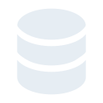
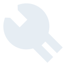
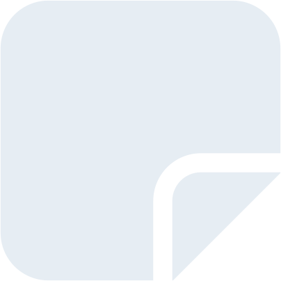
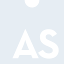
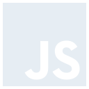
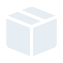
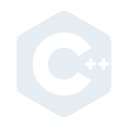
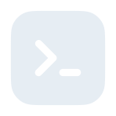

# OuMakdown
OuMarkdown is website catatan berbasis markdown. Website ini merupakan alternatif bagi oujisan untuk membagikan catatan miliknya secara cepat dan kustomisasi bebas. Website ini hanya bisa membaca catatan dari penyimpanan markdown yang disebut [OuValut](https://github.com/oujisan/OuVault). Ouji membuat dan mengedit markdown secara lokal menggunakan [Obsidian](https://obsidian.md/), update catatan akan di push ke repository github dan Web membaca markdown yang tersimpan di OuValut melalui `api.github.com` lalu menampilkannya pada web.

## Stack:
| Language | Framework | Styling |Storage | Library | Deployment
| - | - | - | - | - | - |
|  &nbsp; Typescript |  &nbsp; NextJS |  &nbsp; Tailwind |  &nbsp; Github |  &nbsp; MDX |  &nbsp; Vercel

## Feature:
1. Dapat diakses semua orang
Apabila pengunjung atau Ouji ingin membagikan markdownnya makan terdapat link untuk membaca markdown langsung dari web dengan mudah

2. Icon unik untuk tiap catatan
Setiap markdown akan diawali dengan `# [{category}] {title}`, program akan mendeteksi otomatis category apabila termasuk pada list category yang ada maka akan tampil icon sesuai dengan cateogry yang ada pada [./public/category](https://github.com/oujisan/OuMakdown/tree/main/public/category), apabila tidak ada maka akan menggunakan icon default. Terdapat lebih dari 50 category yang tersedia.

3. Limit API yang Memadai
Dengan menggunakan [Github API](https://docs.github.com/en/rest?apiVersion=2022-11-28) dan [fine grained-tokens](https://github.com/settings/tokens) memungkinkan untuk melakukan 5000 request pada API yang akan direset perjam. Sehingga dapat puas melihat dan membaca markdown tanpa khawatir terkena limit

4. Download markdown
Apabila pengunjung ingin mendownload file markdown, terdapat action button untuk mendownload file menggunakan `https://raw.githubusercontent.com/`.

5. Fitur Pencarian
Diserakan searching untuk mencari catatan lebih cepat dan tersturktur, pengunjung juga bisa mencari berdasarkan category dengan menambahkan `#` pada awal kata search

## Category
|  |  |  |  |  |  |  |  |  |  |
| - | - | - | - | - | - | - | - | - | - |
| 
Ai
 | 
Cloud
 | 
Database
 | 
Git
 | 
Laravel
 | 
Network
 | 
QnA
 | 
Troubleshoot
 | 
Anime
 | 
Code
 |
| 

 | 

 | 

 | 

 | 

 | 

 | 

 | 

 | 

 | 

 |
| 
ExpressJS
 | 
GitHub
 | 
Linux
 | 
Next.js
 | 
React
 | 
C#
 | 
Typescript
 | 
Extension
 | 
HTML
 | 
Logbook
 |
| 

 | 

 | 

 | 

 | 

 | 

 | 

 | 

 | 

 | 

 |
| 
Note
 | 
Review
 | 
Video
 | 
Assembly
 | 
CSS
 | 
Firebase
 | 
Idea
 | 
Matkul
 | 
Penetration
 | 
Script
 |
| 

 | 

 | 

 | 

 | 

 | 

 | 

 | 

 | 

 | 

 |
| 
Vue
 | 
Blockchain
 | 
CTF
 | 
Fix
 | 
JavaScript
 | 
MD
 | 
PHP
 | 
SQLite
 | 
Web
 | 
Box
 |
| 

 | 

 | 

 | 

 | 

 | 

 | 

 | 

 | 

 | 

 |
| 
Dart
 | 
Flutter
 | 
Kotlin
 | 
Music
 | 
PostgreSQL
 | 
Tailwind
 | 
C++
 | 
Game
 | 
Language
 | 
MySQL
 |
| 

 | 

 |
| 
Python
 | 
Terminal
 |
